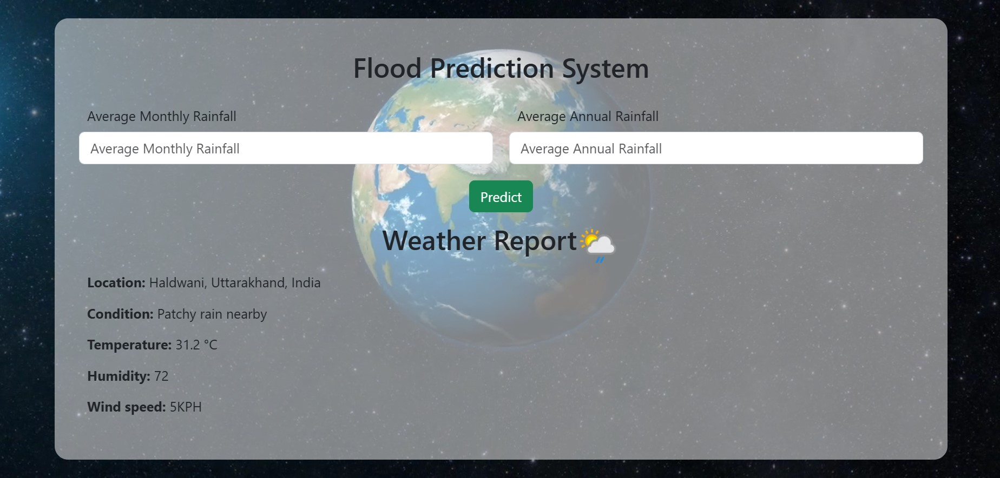

<div align = "center">


# Flood Prediction UI/UX

Flood Prediction UI is a web user interface made using HTML, CSS, JS, and BootStrap and, can be incorporated with backend for Machine Learning(ML/AI) projects. It also uses free WeatherApi and browser GeoLocation API to fetch the user's current location weather. Do not forget to 'star'⭐ the repository, if you like the UI.



</div>

# Installation

- Clone the project

```bash
  git clone https://github.com/sandeepbanoula/FloodPrediction.git
```

- Go to the project directory

```bash
  cd FloodPrediction
```
- Create a config.js file inside the 'js' folder and paste the below code inside.

```bash
  cd js
```

```bash
  const config = {
    apiKey: PASTE YOUR WEATHER_API KEY
    }
```

- Paste your free WeatherApi key from https://www.weatherapi.com/my/ in the config.js file.

```bash
  https://www.weatherapi.com/my/
```
- Open index.html or run live server.

## Contributors ✨

Contributions are always welcome!

<table>
  <tr>
    <td align="center"><a href="https://github.com/sandeepbanoula" target="_blank"><br /><sub><b>Sandeep Banoula</b></sub></a><br /></td>
  </tr>
</table>
